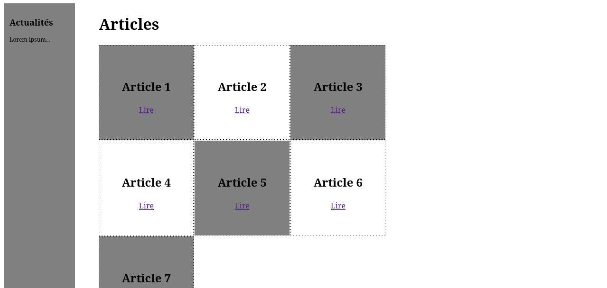
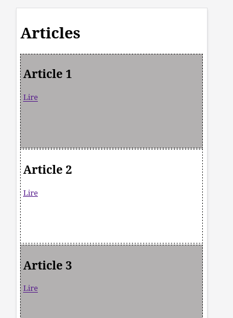

# Exercice 1

Creer un **layout responsive de grid sur 2 tailles d'écran** :

- 3 colonnes x 3 lignes sur *desktop*, à partir de **992px**

- 1 colonne sur mobile/tablette, taille d'écran < à **992px**)

## Références utiles

